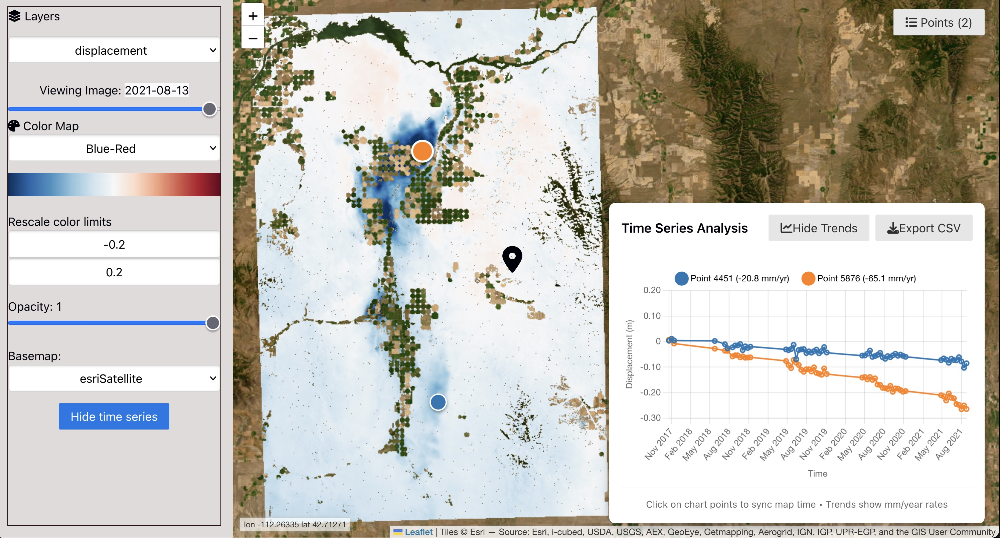

# Bowser

## Quickstart

1. Install [`uv`](https://docs.astral.sh/uv/#installation)
2. Run `uvx --with bowser-insar --stack-file example-stack.zarr`



## Install

```bash
pip install bowser-insar`
```

```bash
uv add bowser-insar
```

For local development, clone and create a conda environment:
```bash
git clone git@github.com:opera-adt/bowser.git && cd bowser
mamba env create
conda activate bowser-env
pip install .
```

## Quickstart for dolphin

- `bowser setup-dolphin` is preconfigured to make a JSON file pointing to the outputs inside `work_directory` of dolphin
- `bowser run` starts the web server on `localhost`:

```
$ bowser setup-dolphin work/
Reading raster metadata: 100%|████████████████████████████████████████████████████████████████████████████████████████████████████████████████████████████████████████████████| 2/2 [00:00<00:00, 236.13it/s]
Reading raster metadata: 100%|█████████████████████████████████████████████████████████████████████████████████████████████████████████████████████████████████████████████████| 2/2 [00:00<00:00, 95.74it/s]
Reading raster metadata: 100%|████████████████████████████████████████████████████████████████████████████████████████████████████████████████████████████████████████████████| 2/2 [00:00<00:00, 266.77it/s]
Reading raster metadata: 100%|████████████████████████████████████████████████████████████████████████████████████████████████████████████████████████████████████████████████| 1/1 [00:00<00:00, 100.49it/s]
Reading raster metadata: 100%|█████████████████████████████████████████████████████████████████████████████████████████████████████████████████████████████████████████████████| 1/1 [00:00<00:00, 94.88it/s]

$ bowser run
INFO:     Uvicorn running on http://127.0.0.1:8000 (Press CTRL+C to quit)
INFO:     Started parent process [99855]
...
```

Click on the `http://127.0.0.1:8000` link to open the map.


**Note for running over ssh**: you will need to run an ssh command creating a tunnel from your local computer to wherever the `bowser` server is.
For example, if you machine is `myserver`, you would run in a local terminal

```bash
ssh -N -L 8000:localhost:8000 myserver
```

after starting the web server.

## Running in Jupyter

```python
from bowser._widget import make_bowser_widget

# Automatically starts server and creates widget
widget = make_bowser_widget(rasters_file="bowser_rasters.json")
widget
```

## Quickstart for DISP-S1 NetCDFs

Until GDAL puts work into the NetCDF driver, reading remote HDF5/NetCDF files has very poor support. Additionally, there is no standard overview format as there is with GeoTIFFs, so `titiler` is very unhappy.

We can get around this to some degree by creating [VRTs](https://gdal.org/drivers/raster/vrt.html) and [making external overviews](https://gdal.org/programs/gdaladdo.html) pointing at these VRTs.

1. Download the NetCDFs (hopefully on some server which has fast access to the S3 bucket).
2. Run `bowser prepare-disp-s1` to create VRT files pointing in the `.nc` files, one per dataset we wish to browse.
3. Run `bowser setup-disp-s1` to make a JSON file containing all the file metadata, so the browser knows where to look.
4. `bowser run`

In detail:

1. Download
I use [`s5cmd`](https://github.com/peak/s5cmd) for faster copying, but the `aws` CLI tool works too:

```bash
mkdir my_disp_files; cd my_disp-files
s5cmd --numworkers 4 cp 's3://opera-bucket/OPERA_L3_DISP-S1_IW_F11115*/OPERA_L3_DISP-S1_IW_F11115*.nc' .
```

2. Extract VRTS

```bash
bowser prepare-disp-s1 -o vrts *.nc
```

3. Create `bowser_rasters.json` metadata

```bash
bowser setup-disp-s1 vrts
```

4. Run

```bash
bowser run
```

If this is on a server instead of your laptop, you'll need (on your laptop)

```
ssh -N -L 8000:localhost:8000 myserver
```
for whatever port pops up after `bowser run`


## CLI Usage

```bash
$ bowser --help
Usage: bowser [OPTIONS] COMMAND [ARGS]...

  CLI for bowser.

Options:
  --help  Show this message and exit.

Commands:
  addo           Add compressed GDAL overviews to files.
  run            Run the web server.
  set-data       Specify what raster data to use.
  setup-dolphin  Set up output data configuration for a dolphin workflow.
```

To manually specify a raster/set of rasters, use the interactive `bowser set-data`

## Developer Setup

`npm` is used to manage javascript dependencies.

`npm install` will install all dependencies.

### Making changes to the UI

After making `.tsx`, HTML or CSS changes, **you must run** `npm run build` to build the project:

```bash
$ npm run build

> bowser-js@0.0.0 build
> tsc && vite build

vite v5.4.19 building for production...
✓ 391 modules transformed.
src/bowser/dist/index.html      0.85 kB │ gzip:   0.51 kB
src/bowser/dist/index.css      25.68 kB │ gzip:   9.13 kB
src/bowser/dist/index.js    1,086.17 kB │ gzip: 241.12 kB
```

This updates the `dist` directory, which is served when you run `bowser run ...`.

Currently the `dist/` HTML and CSS files are checked in to git for easier deployment for non-javascript users.

## License

Copyright 2024, by the California Institute of Technology. ALL RIGHTS RESERVED. United States Government Sponsorship acknowledged. Any commercial use must be negotiated with the Office of Technology Transfer at the California Institute of Technology.

This software may be subject to U.S. export control laws. By accepting this software, the user agrees to comply with all applicable U.S. export laws and regulations. User has the responsibility to obtain export licenses, or other export authority as may be required before exporting such information to foreign countries or providing access to foreign persons.
